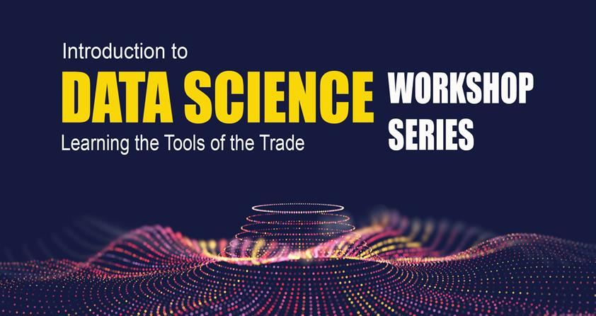

@snap[north span-100]
### Introduction to Python for Data Science
@snapend

@snap[south-west text-08]
@fa[twitter](TheSandyCoder)
@snapend

@snap[south text-08]
@fa[github](davidrpugh)
@snapend

@snap[south-east text-08]
@fa[linkedin](davidrpugh)
@snapend

#### Dr. David R. Pugh
Staff Scientist, KVL

---?image=assets/img/nist-data-science-skillsets.jpg&size=75% 75%

@snap[north]
#### What is Data Science?
@snapend

---

## Why Learn Python for Data Science?

---?image=assets/img/data-science-programming-languages.png&size=75% 75%

@snap[north]
#### Python is widely used...
@snapend

---?image=assets/img/data-science-tasks.png&size=75% 75%

@snap[north span-100]
#### ...great for many common tasks...
@snapend

---?image=assets/img/data-science-viz-tools.png&size=75% 75%

@snap[north]
#### ...including data viz...
@snapend

---?image=assets/img/data-science-machine-learning-tools.png&size=75% 75%

@snap[north span-100]
#### ...and especially ML/DL
@snapend

---
## Python is only one tool in the toolbox!

---
@snap[north span-100]
#### Other core Data Science skills
@snapend

@ul[spaced]
* version control using Git (and GitHub or GitLab!)
* SQL programming
* Unix shell (Bash) programming 
* working remotely with clusters
* container-based workflows
@ulend

---
 
